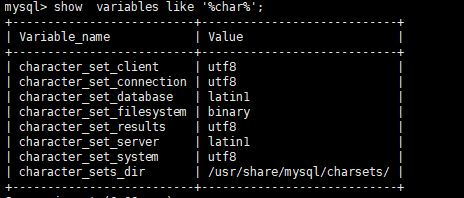

* content
{:toc}

## 填一个设置mysql字符集的陈年老坑

  当初最开始学习mysql的时候，插入进去的中文老是乱码，查了许多资料。从修改数据库字符集，修改数据库引擎的字符集，到修改my.ini文件都试了一遍，
然而都没有卵用，最近又遇到这个问题，这次终于解决掉了。


### 首先是mysql的版本，如图



### 出现的错误

```
mysql> insert into test(name,sec,age) values('张三','男',1);
  
ERROR 1366 (HY000): Incorrect string value: '\xE5\xBC\xA0\xE4\xB8\x89' for column 'name' at row 1  
```

### 首先查看当前数据库的编码

`show variables like  \'%char%\'`

然后可以看到


当时我的状态是character_set_server和character_set_database的值为latin1

解决办法是：

```
   set character_set_server=utf8;
   
   set character_set_database=utf8;
```

然后重启数据库，就可以看到上面两个参数的值已经改为了utf8,然后就可以愉快的使用了。

### 注意
关于mysql服务重启的问题
* service mysqld  restart(5.0版本）
* service mysql restart（5.5.7版本）


