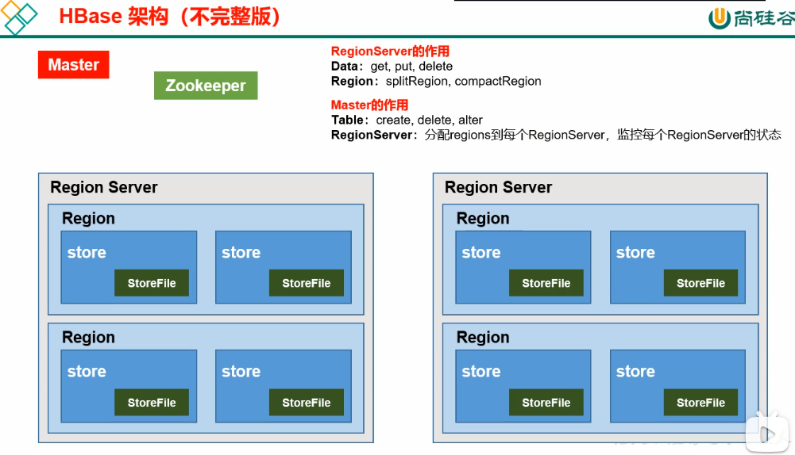
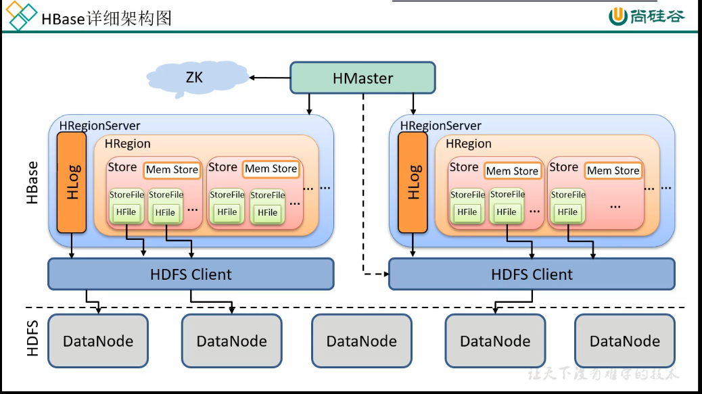

* content
{:toc}

### Hbase是一个分布式、可扩展、可以存储海量数据的Nosql数据库
1. Hbase的数据模型和关系型数据库很相似，但是在底层的物理存储实现上，相当于一个多维的Map
2. Hbase存储的逻辑结构
3. Hbase存储的物理结构

4. 数据模型
    * 命名空间，相当于mysql的数据库，Hbase有两个自带的命名空间，hbase和default,hbase存放Hbase的元数据
    * Region，相当于mysql的表，当表逐渐变大的时候一张表可以包含多个region。hbase定义表的时候可以只定义列族，不用指定具体的列，所以可以更灵活的插入数据
    * row，hbase中的一行数据有rowkey和多个列组成，数据按照rowkey的字典顺序存储的，在检索的时候完全按照rowkey进行检索，所以rowkey的设计很重要
    * column,hbase中的每个列必须有column family:column qualifier进行限定,例如info：age info:name
    * Timestamp，表示数据的版本，如果不主动添加，系统会帮你添加
    * cell单元格{rowkey,column family:column qualifier,timestamp}唯一确定一个cell,cell中的数据没有格式，使用字节码存储的

###Master与RegionServer的区别
1. Master
    * DDL
    * 将region分配给RegionServer,监控RegionServer的状态
2. RegionServer
    * DML
    * split region和compact region

### Hbase的详细架构

* Hlog文件放置内存中的数据丢失，叫做预写入文件
* zookeeper帮助HMaster处理来自client的请求
### Region Compact和Region Split

