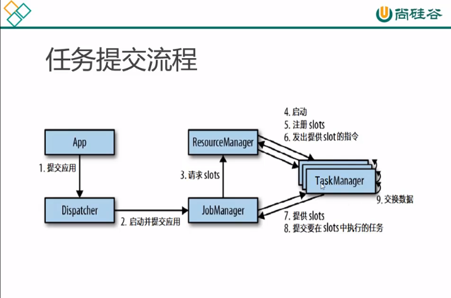

* content
{:toc}

### Flink是一个框架和分布式处理引擎，用于对有界或者无界的数据流进行处理。流数据的处理方式更加真实的反应我们的生活方式，之前数据架构都是针对有限的数据集合
我们需要低延迟和高吞吐量以及较好的准确率和容错率。
那些行业需要流数据：电商和市场营销、物联网、电信业、银行和金融业
1. Flink运行时架构
    * JobManager、TaskManager、ResourceManager、Dispacher
    * JobManager是一个控制应用程序执行的主进程，jobmanager会收到应用程序，这个应用程序包括作业图、逻辑数据流图和打包的所有的类库
    * JobManager会将作业图（Jobgraph)转化为一个物理层面的数据流图，叫做”执行图“，包含了可以并发执行的任务。
    * JobManager向ResourceManager申请资源，也就是TaskManager的slot，一旦获得足够的资源，就将执行图发到相应的TaskManager上执行，JobManager作为中央节点进行协调。

2. TaskManager是工作进程，每一个都包含一定数量的slot，slot的数量显示了TaskManager可以执行任务的数量。在启动后，TaskManager向ResourceManager注册自己的slot，收到
ResourceManager的指令后，就将一个或者多个slot提交给JobManager进行调用。JobManager就可以将slot分配给任务了。
3. flink任务提交流程

