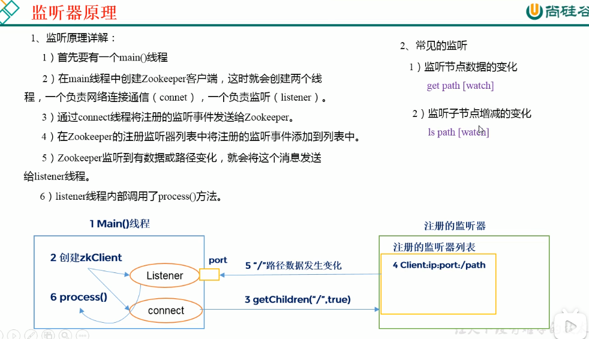

* content
{:toc}

### zookeeper是一个开源的、分布式的，为分布式应用提供协调服务的Apache项目
1. zookeeper负责存储和管理大家都关心的数据，然后接受观察者的注册，当数据发生变化时，zookeeper就通知这些观察者发生的变化然后做出相应的改变。
zookeeper=文件系统+通知机制。
2. 监听的流程
    * 服务器上线时进行注册，创建临时节点
    * 客户端获取到当前在线的服务器列表，并且注册监听事件
    * 一旦服务器出故障下线，客户端就会收到服务器下线通知，然后进行相应的操作。
3. 特点
    * 一个leader，多个follower组成的集群。
    * 集群中超过半数的服务器存活，集群都能运行。
    * 集群中每个服务器上的数据都相同，保存同一份相同的副本。
    * 更新具有顺序性，来自同一个client的请求顺序执行
    * 数据更新具有原子性
    * 实时性，在一定的时间范围内，client可以读到最新的数据。
4. 应用场景
    * 统一命名服务。在分布式环境下，需要对应用或者服务进行统一命名，便于识别。例如IP不容易记住，但域名容易。
    * 分布式环境下，配置文件必须同步，所有节点的配置信息相同，比如kafka集群，在对配置文件进行修改之后，可以快速的同步到节点上
    * 配置管理。将配置信息写入到一个Znode，然后各个客户端来监听这个Znode。
    * 客户端能实时的洞察到服务器的上下线
    * 软负载均衡。在zookeeper中记录所有服务器的访问数，让访问数最少的服务器处理最新的请求。
5. 配置参数
6. 选举机制
    * 半数机制，超过半数以上的存活可运行，所以适合奇数台服务器的集群。
7. 节点类型
    * 持久化节点，客户端与zookeeper断开之后，节点依旧存在。zookeeper会给节点进行编号，便是时间的发生顺序。
    * 短暂节点
8. 监听原理

9. 常见的面试题
    * zookeeper的选举机制。半数原理
    * zookeeper的监听原理。
    * zookeeper的部署模式，角色有哪些，至少需要几台
    * 

